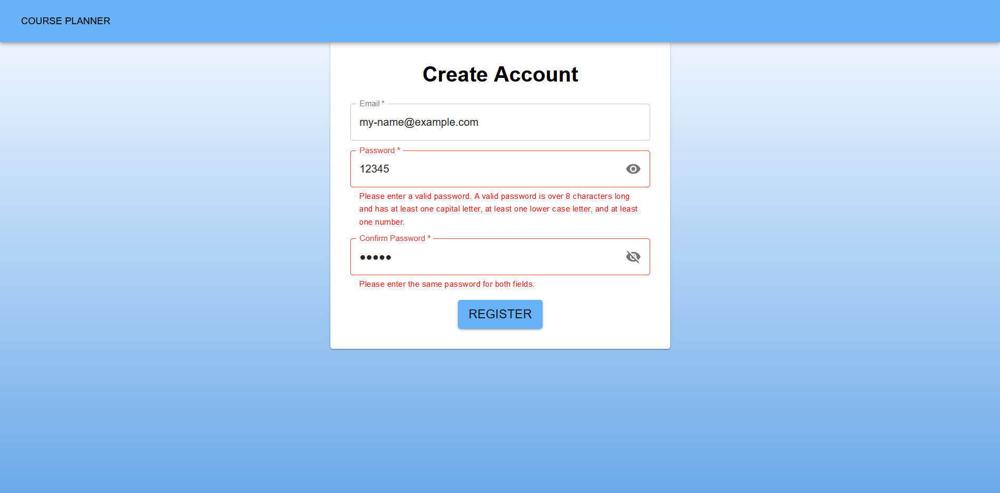
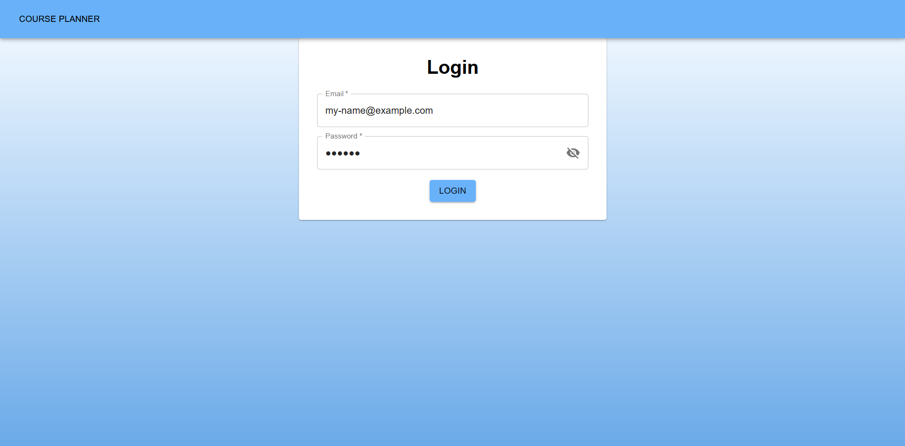
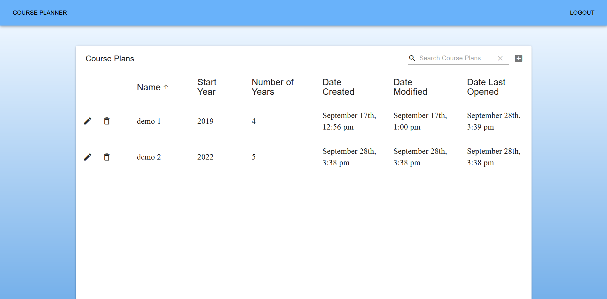
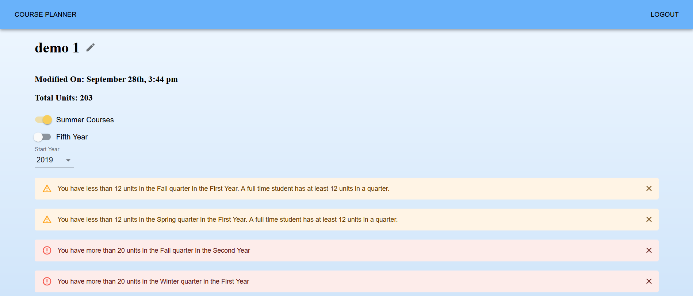
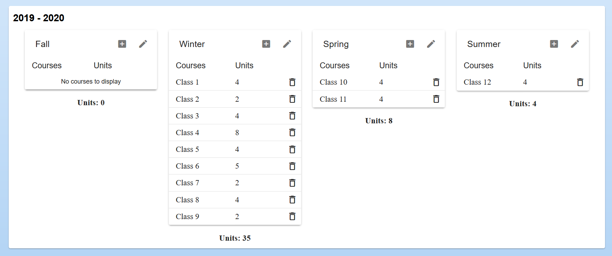
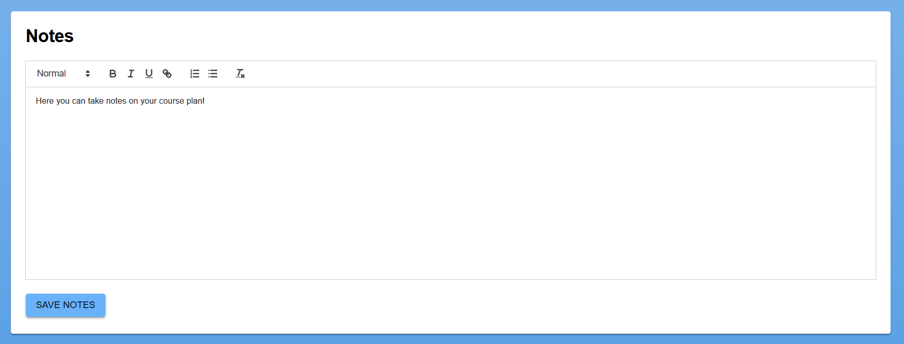

## Course Planner
This website is a tool for students to create and save long-term plans. It features an account system with encrypted passwords for security, and an interface for creating, modifying, and deleting four and five year plans. Each plan can be customized, with options to select start year, number of years, and whether to include summer courses. Users can add courses to the fall, winter, spring, and (optionally) summer quarters of each year. Along with the course code, users can enter the number of units in each course. The plan will display quarterly and overall unit totals based on this data.

## Motivation
A long term plan is an extremely helpful tool for college students, and many students develop more than one in order to explore possiblities or prepare for different circumstances. Our website helps students keep track of their plans, providing them with a centralized place to store and update all of their long term plans.

## Screenshots

Creating an account. For security reasons, the password guidelines must be met before the user can create an account.

Logging in.

The dashboard. From here, the user can view a list of the saved plans, with options to edit or delete each.

Viewing a plan. From here the, the user can edit the name, start year, and number of years of the plan, as well as toggle summer courses, edit course lists, and edit notes. Multiple alerts have appeared warning the user that the plan has quarters with too few or too many units.

The user can enter as many courses as they would like for each quarter. Each class has a course code and number of units. Quarterly unit totals display below each quarter.

The user can enter notes related to the plan.

## Tech/framework used

**Built with**
- [MongoDB](https://www.mongodb.com/) used to store account and plan data
- [Express](https://expressjs.com/) used for routing
- [React](https://reactjs.org/) used for the frontend
- [Node.js](https://nodejs.org/en/) used for backend
- [Redux](https://redux.js.org/) used for the managing the state in the frontend
- [Material-UI](https://material-ui.com/) used for the frontend (form inputs, headers, alerts, etc)
- [material-table](https://material-table.com/#/) used for the frontend (tables in dashboard and plan view)
- For the rest of the packages, refer to package.json in the main and client folders

## Features
- Create, edit, and delete plans
- Set start year and number of years (4 or 5)
- Quarter system with fall, winter, spring, and summer
- Summer quarter can be toggled on and off
- Quarters can each have any number of courses
- Enter the units for each course to get quarterly and overall unit totals
- Alerts warn if a quarter has too many (over 20) or too few (under 12) units
- Plan name, start year, number of years can all be edited, as well as the courses in each quarter
- Editable notes associated with each plan

## Installing and Running
Run this project by: downloading the code, creating a new MongoDB atlas server, copy pasting the MongoURI into config/default.json, and running "npm run dev". 

## License

MIT © [Course Planner](https://github.com/Course-Planner-UCSD/CoursePlanner/)
